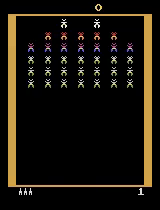

# Galaxian Game Reinforcement Learning Project

## Overview

This project focuses on training an agent to play the Galaxian game using Deep Reinforcement Learning (DRL). The agent employs advanced neural network architectures and techniques to enhance its decision-making capabilities in the dynamic game environment.




## Installation

1. Clone the repository:
   ```bash
   https://github.com/khashayarghamati/Galaxian-Game-Reinforcement-Learning.git
   ```

2. Create and activate a Conda environment:
   ```bash
   conda env create -f environment.yml
   conda activate gal3
   ```

3. Set up Neptune API Token and Project Name:
   - Add your Neptune API token and project name to the `.env_temp` file:
     ```dotenv
     NEPTUNE_TOKEN=your_api_token
     NEPTUNE_PROJECT=your_project_name
     ```
   - Rename the file from `.env_temp` to `.env`.

## Usage

1. Run the training script:
   ```bash
   python main.py
   ```

2. Once training is complete, run the agent in the game environment:
    - Edit `replay.py` and pass your checkpoint file path to `Path()` in that file.
       ```python
        # Edit this line in replay.py
        path = Path('your_checkpoint_path.chkpt')
       ```
   - Run `replay.py`:
     ```bash
     python replay.py
     ```
   - After running, it will generate a `vid.mp4` video for you to observe the training progress.

